# Lab1Web – Praktikum 1: HTML Dasar

**Mata Kuliah:** Pemrograman Web
**Nama:** Laurensius Rivaldo Nahak
**NIM:** 312310727
**Kelas:** I251D

## Struktur Folder

```
Lab1Web/
├── index.html
├── halaman2.html
├── images/
│   └── profil.jpg
├── screenshots/
└── README.md
```

> Catatan: letakkan screenshot pada folder `screenshots/` sesuai nama file pada tiap langkah di bawah.

---

## Langkah-langkah Praktikum

### Langkah 0 – Persiapan
Membuka Visual Studio Code, membuat folder kerja `praktikum-1-html-dasar` (di repository menjadi `Lab1Web`), lalu membuat file `index.html`.

*(Screenshot tampilan VSCode dan struktur folder: ambil sendiri dari komputer Anda, simpan sebagai `screenshots/00-persiapan.png`, lalu tambahkan dengan ``.)*

### Langkah 1 – Struktur Dasar HTML
Menulis struktur dasar dokumen: `<!DOCTYPE html>`, `<html>`, `<head>` (berisi `<title>`), dan `<body>`. File disimpan lalu dibuka di browser. Pada tahap ini halaman masih kosong, hanya judul tab yang muncul ("Praktikum HTML Dasar").

Pada `<html>` ditambahkan `lang="id"` dan pada `<head>` ditambahkan `<meta charset="UTF-8">` agar lolos validasi W3C tanpa peringatan dan karakter tampil benar.

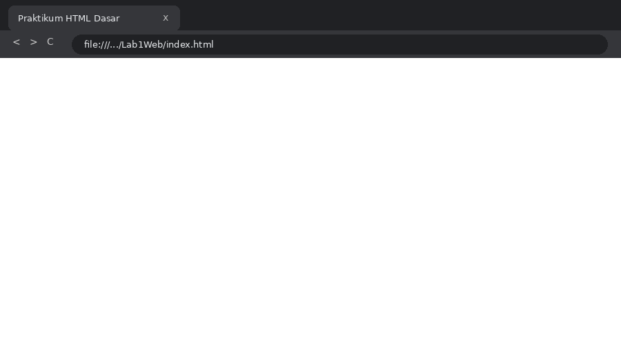

### Langkah 2 – Membuat Paragraf
Menambahkan dua paragraf dengan tag `<p>`. Browser otomatis memberi jarak antar paragraf. Ganti baris di kode tidak menghasilkan baris baru di browser, sebab browser menggabungkan spasi dan baris kosong.

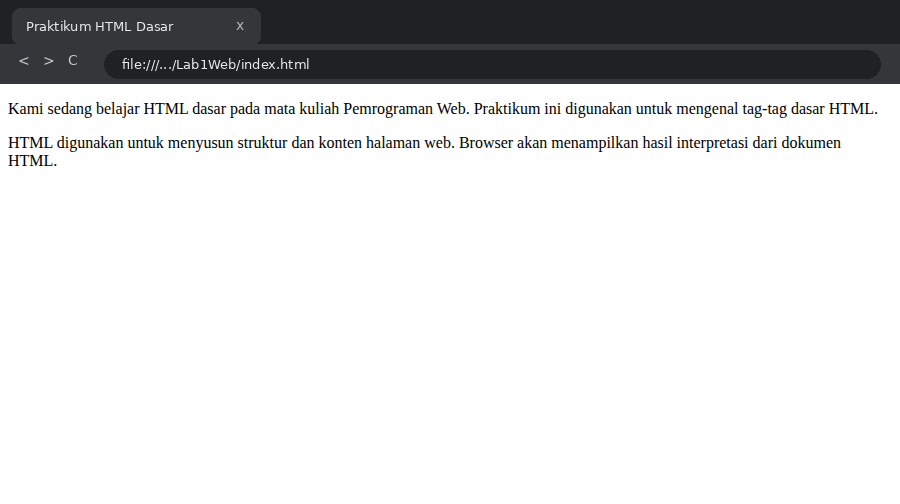

### Langkah 3 – Menambahkan Judul (Heading)
Menambahkan `<h1>` sebagai judul utama ("Belajar Dasar HTML") dan `<h2>` sebagai subjudul ("Paragraf pada HTML"). Heading `h1` tampil paling besar, `h2` lebih kecil.

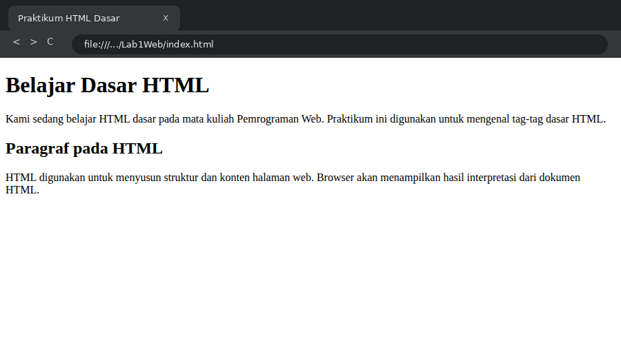

### Langkah 4 – Memformat Teks
Menggunakan `<b>`, `<i>`, `<strong>`, `<sub>`, dan `<sup>`. Ditambah eksperimen dengan `<em>`, `<mark>`, `<small>`, `<del>`, dan `<ins>`:
- `<b>` / `<strong>`: teks tebal (`strong` bermakna penting)
- `<i>` / `<em>`: teks miring (`em` bermakna penekanan)
- `<mark>`: teks diberi stabilo
- `<small>`: teks lebih kecil
- `<del>` / `<ins>`: teks dicoret / digarisbawahi
- `<sub>` / `<sup>`: subscript (H₂O) / superscript (x²)

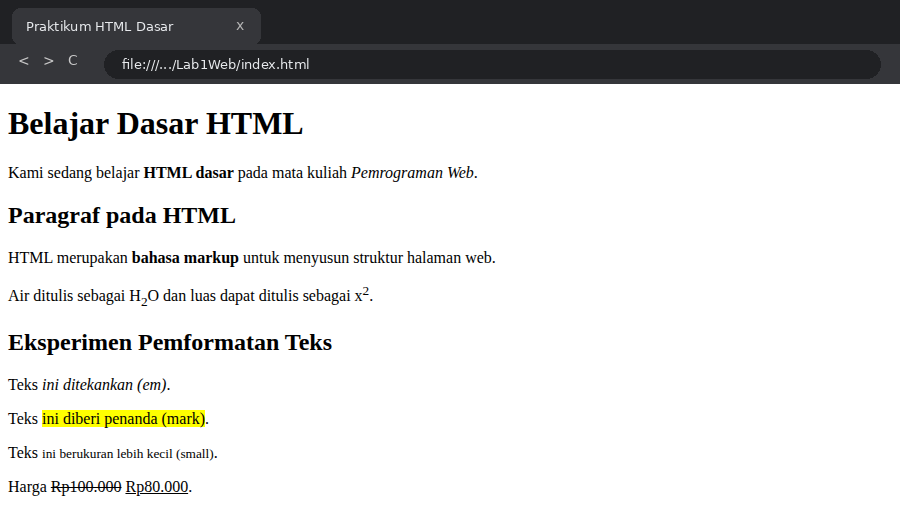

### Langkah 5 – Menyisipkan Gambar
Membuat folder `images`, menyimpan `profil.jpg`, lalu menampilkannya dengan ``.

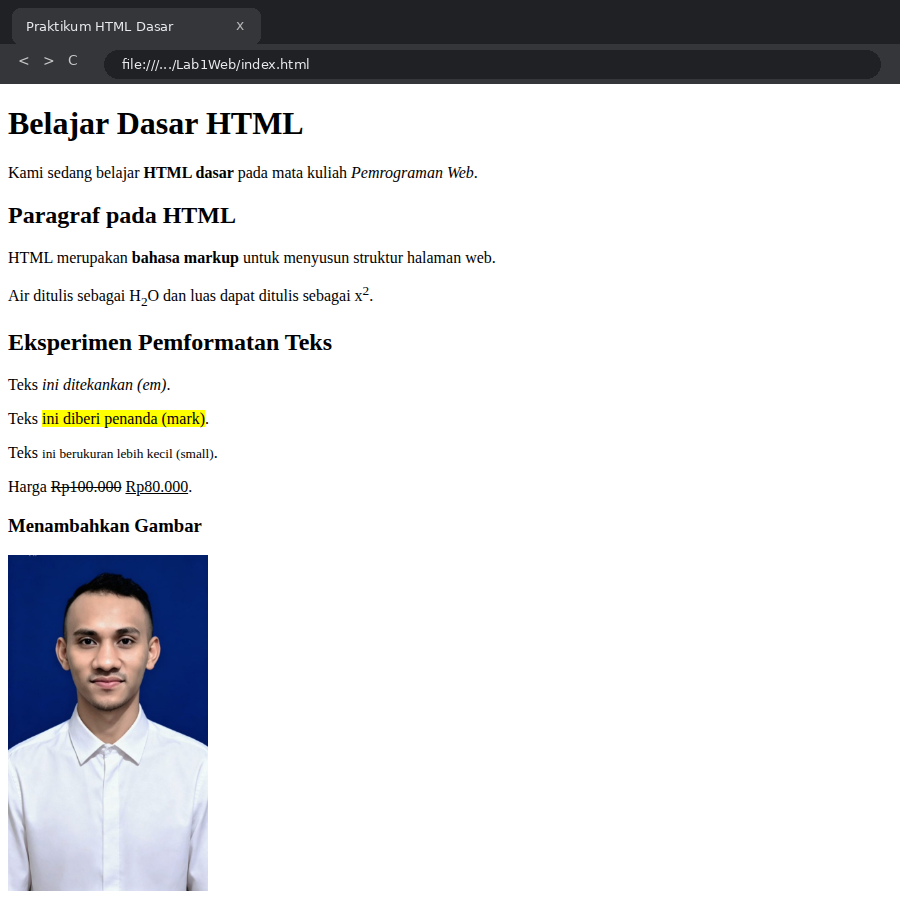

### Langkah 6 – Mengatur Ukuran Gambar
Atribut `width` diatur untuk mengubah lebar gambar; pada screenshot dibandingkan `width="100"`, `"200"`, dan `"300"`. Tinggi menyesuaikan otomatis mengikuti rasio. Nilai `width` dan `height` dapat diubah untuk melihat perubahannya.

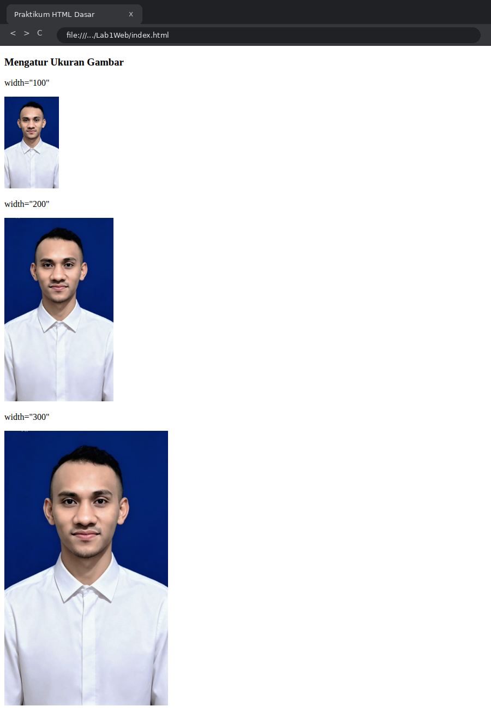

### Langkah 7 – Menambahkan Hyperlink
Membuat `halaman2.html`, lalu menambahkan menu `<nav>` berisi tautan ke `index.html`, `halaman2.html` (internal), dan `https://www.google.com` (eksternal). Semua tautan diuji dengan cara diklik. Selain itu dicoba anchor ke bagian halaman yang sama (`<a href="#profil">`).

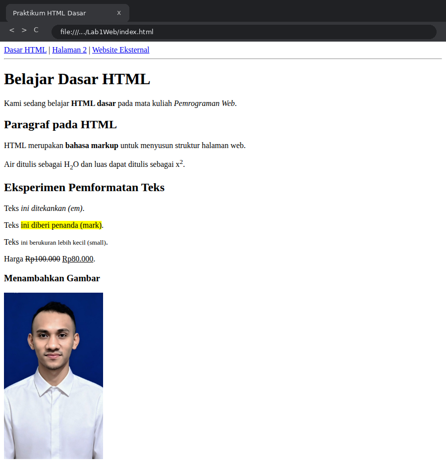

Halaman tujuan setelah tautan "Halaman 2" diklik:

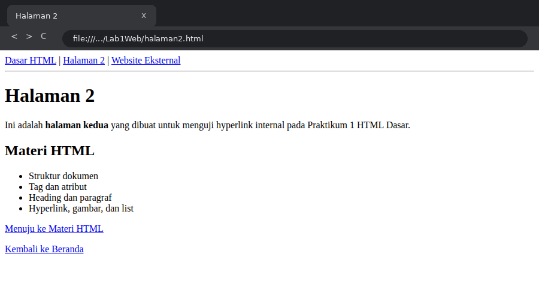

### Langkah 8 – Menambahkan List
Membuat daftar keahlian dengan `<ul>` (bullet) dan daftar urutan belajar dengan `<ol>` (bernomor), dengan item `<li>`.

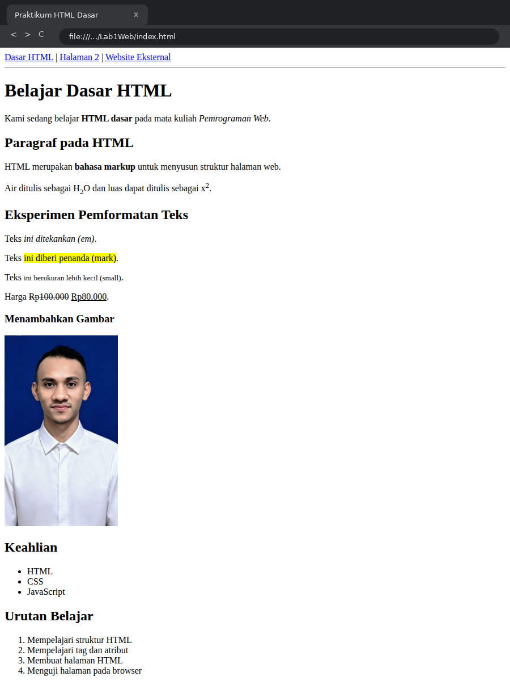

### Langkah 9 – Menambahkan Komentar
Menambahkan komentar `<!-- ... -->` sebagai penanda bagian kode (Bagian Profil Mahasiswa, Bagian Keahlian, dsb.). Komentar tidak tampil di browser.

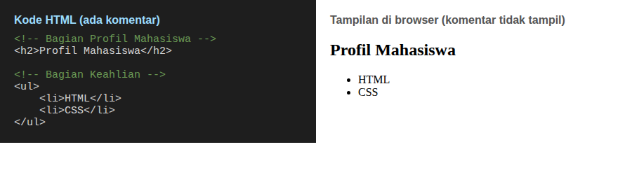

### Langkah 10 – Menggabungkan Semua Elemen
Menyusun halaman **Profil Mahasiswa** yang menggabungkan nav, heading, gambar, paragraf, ul, dan ol.

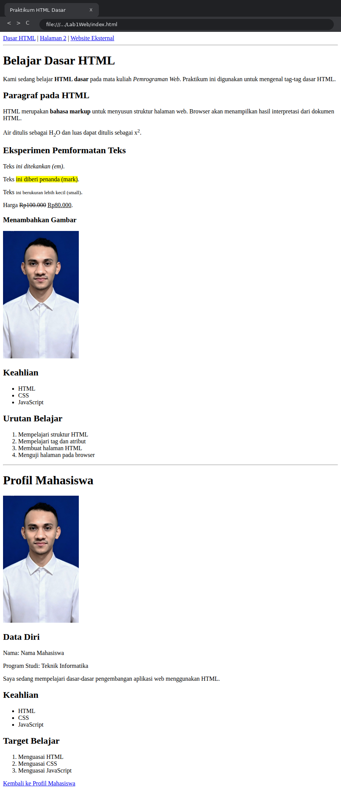

### Langkah 11 – Validasi HTML
Kode diperiksa menggunakan <https://validator.w3.org> (Validate by File Upload). Hasil: tidak ada error.

*(Screenshot hasil validator W3C: ambil sendiri setelah mengunggah `index.html` dan `halaman2.html` ke https://validator.w3.org, simpan sebagai `screenshots/11-validasi.png`, lalu tambahkan dengan ``.)*

---

## Jawaban Pertanyaan

**1. Apa fungsi deklarasi `<!DOCTYPE html>` pada dokumen HTML?**
Menyatakan kepada browser bahwa dokumen ditulis dengan standar HTML5, sehingga browser merender halaman dalam *standards mode* (bukan *quirks mode*) dan dokumen dapat divalidasi. Ditulis paling awal di dokumen.

**2. Apa perbedaan antara tag, elemen, dan atribut pada HTML?**
- **Tag**: penanda awal/akhir yang ditulis dengan kurung siku, misalnya `<p>` dan `</p>`.
- **Elemen**: kesatuan lengkap, yaitu tag pembuka + isi + tag penutup (dan atribut jika ada), misalnya `<p>Halo</p>`.
- **Atribut**: informasi tambahan pada tag pembuka berbentuk `nama="nilai"`, misalnya `href="..."` pada `<a>`.

**3. Apa perbedaan `<p>` dengan `<br>`? Jelaskan penggunaannya.**
`<p>` membuat satu blok paragraf lengkap dengan jarak di atas dan bawahnya, serta punya tag penutup. `<br>` hanya memindahkan teks ke baris baru di dalam blok yang sama, tanpa isi dan tanpa tag penutup. Gunakan `<p>` untuk memisahkan paragraf, dan `<br>` untuk baris baru di tengah teks, misalnya pada alamat atau bait puisi.

**4. Apa fungsi atribut `href` pada tag `<a>`?**
`href` (*hypertext reference*) menentukan tujuan tautan: URL, path file lain, atau id elemen di halaman yang sama (`#id`). Tanpa `href`, `<a>` tidak berfungsi sebagai hyperlink.

**5. Apa perbedaan hyperlink ke halaman internal dengan hyperlink ke website eksternal?**
Hyperlink internal mengarah ke halaman dalam website/proyek yang sama dan cukup memakai path relatif, misalnya `href="halaman2.html"`. Hyperlink eksternal mengarah ke website lain dan memakai URL lengkap dengan protokol, misalnya `href="https://www.google.com"`.

**6. Apa fungsi atribut `src` dan `alt` pada tag ``?**
`src` menentukan lokasi (path/URL) file gambar yang ditampilkan. `alt` adalah teks alternatif yang tampil bila gambar gagal dimuat, dibacakan oleh *screen reader* untuk aksesibilitas, dan dibaca mesin pencari.

**7. Apa perbedaan penggunaan `<ul>` dan `<ol>`?**
`<ul>` (*unordered list*) untuk daftar tanpa urutan, ditandai bullet. `<ol>` (*ordered list*) untuk daftar berurutan, ditandai nomor. Keduanya memakai `<li>` untuk setiap itemnya.

**8. Apa yang terjadi jika path gambar pada atribut `src` salah?**
Gambar tidak dapat ditemukan sehingga tidak tampil. Browser menampilkan ikon gambar rusak (*broken image*) beserta teks `alt` jika ada. Karena itu atribut `alt` penting untuk diisi.

**9. Mengapa struktur heading h1 sampai h6 perlu digunakan secara terstruktur?**
Agar hierarki isi halaman jelas (judul utama → subjudul → sub-subjudul), memudahkan pembaca, memudahkan pengguna *screen reader* bernavigasi, dan membantu SEO karena mesin pencari memahami struktur konten. Heading dipilih berdasarkan makna, bukan sekadar ukuran huruf, dan sebaiknya tidak melompati level (misalnya dari `h1` langsung ke `h4`).

**10. Apa fungsi komentar `<!-- ... -->` dalam kode HTML?**
Memberi catatan/penanda pada kode agar mudah dipahami, dan menonaktifkan kode sementara tanpa menghapusnya. Komentar diabaikan browser dan tidak tampil di halaman (namun tetap terlihat di *view source*).

---

## Checklist

- [x] Struktur HTML sudah lengkap
- [x] Heading dan paragraf sudah digunakan
- [x] Pemformatan teks sudah dicoba
- [x] Gambar tampil dengan benar
- [x] Hyperlink internal dan eksternal dapat digunakan
- [x] Unordered list dan ordered list sudah dibuat
- [x] Komentar HTML sudah dicoba
- [x] Screenshot setiap tahap sudah tersedia (kecuali langkah 0 dan 11, lihat catatan)
- [x] README.md sudah menjelaskan proses praktikum
- [ ] Repository sudah di-commit dan URL sudah siap dikirim
